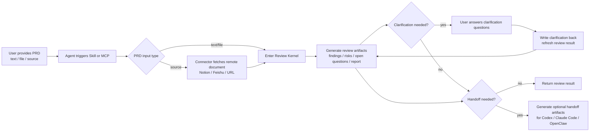

# Multi-Agent Requirement Review Engine

A LangGraph-based requirement review engine that turns requirement sources into normalized review artifacts.

## System Position

The repository should be evaluated against this review-engine contract:

`source input -> review mode gating -> normalizer -> parallel reviewers -> aggregator -> review artifacts`

That review-result-first flow is the main architecture and the primary adoption path.

## User Flow



## Recommended Boundary

Treat PRDReview primarily as a review kernel that turns requirement content into stable review artifacts.

- Core path: `prd_text`, `prd_path`, and local text files flowing into review results.
- Optional integration path: connector-backed `source` intake, clarification writeback, and downstream agent handoff preparation.
- Prefer `prd_text` or `prd_path` when the caller can already fetch and normalize source content.
- Use connector-backed `source` mainly for weak callers that can identify a document location but cannot fetch its content themselves.

## Package Status

Package version `0.6.0` marks the current milestone baseline.

The review flow is usable today, but this package should not yet be treated as a fully stabilized platform release.

## Core Capabilities

- Review-kernel intake through `prd_text`, `prd_path`, and local text files
- Review mode gating to choose between `single_review` and `parallel_review`
- Requirement normalization into reviewer-specific views
- Multi-role review across product, engineering, QA, and security perspectives
- Aggregation of reviewer findings, risks, open questions, and conflicts
- Review artifact generation for both human-readable and machine-readable outputs
- CLI, FastAPI, and MCP entrypoints centered on producing review results
- Clarification writeback for human-in-the-loop review refinement
- Agent handoff preparation for Codex, Claude Code, and OpenClaw
- Optional connector-backed source intake for Feishu, Notion, and public URLs

## Supported Input Boundaries

- `prd_text`, `prd_path`, and local `.md` / `.txt` files remain the primary ingestion path.
- `URLConnector` supports public `http/https` text pages.
- `FeishuConnector` supports authenticated `feishu://...` inputs and recognized Feishu/Lark document URLs for supported `wiki`, `docx`, and legacy `docs` sources.
- `NotionConnector` supports authenticated `notion://page/...` inputs and recognized Notion page URLs, returning normalized Markdown content from the Notion API.
- Configure Feishu access with `MARRDP_FEISHU_APP_ID`, `MARRDP_FEISHU_APP_SECRET`, and optional `MARRDP_FEISHU_OPEN_BASE_URL`.
- Configure Notion access with `MARRDP_NOTION_TOKEN`, and optionally override `MARRDP_NOTION_API_BASE_URL` plus `MARRDP_NOTION_API_VERSION`.
- Controlled Feishu fetch failures are surfaced explicitly as authentication, permission, not-found, or unsupported-document-type errors in the API and MCP layers.
- Controlled Notion fetch failures are surfaced explicitly as authentication, permission, not-found, rate-limit, or network errors in the API and MCP layers.
- Local-file and public-URL ingestion behavior is unchanged.

When deciding whether to use connector-backed `source` intake:

- Prefer caller-side fetch plus `prd_text` when the caller already has access to the source system.
- Prefer project-side `source` intake when you need one-hop review from document identifiers, centralized auth, or persisted source metadata in review artifacts.

## Source Support

- Local files: supported
- Public URLs: supported
- Feishu/Lark: supported
- Notion: supported

## Repository Layout

- `requirement_review_v1/`: review engine, service layer, API, MCP server, connectors, and supporting modules
- `review_runtime/`: shared runtime config and model provider utilities
- `docs/`: architecture notes, API docs, MCP docs, and implementation plans
- `eval/`: evaluation scripts
- `tests/`: automated tests
- `data/`: local knowledge and runtime data

## Installation

```bash
pip install -e .
```

`requirements.txt` remains as a thin compatibility wrapper around `pyproject.toml`, so package metadata and dependencies only need to be maintained in one place.

## Quick Start

Use Docker to build and start the backend plus the production frontend bundle:

```bash
docker-compose up --build
```

## Feishu Plugin Deployment

Use the Feishu plugin entry layer when you want users to submit and follow up on review runs from inside Feishu, while still reusing the existing review engine.

### What To Configure In Feishu

Create one Feishu app and prepare these capabilities:

1. Enable bot or event subscription delivery to the backend.
2. Configure the backend callback URL for Feishu events:
   - `POST https://<your-domain>/api/feishu/events`
3. Configure the plugin-side review submit target:
   - `POST https://<your-domain>/api/feishu/submit`
4. Configure the plugin-side clarification answer target:
   - `POST https://<your-domain>/api/feishu/clarification`
5. Configure the in-Feishu H5 result page URL:
   - `https://<your-domain>/run/<run_id>?embed=feishu&open_id=<open_id>&tenant_key=<tenant_key>`

### Required Environment Variables

The following variables must be present before Feishu plugin traffic is enabled:

- `MARRDP_FEISHU_APP_ID`
- `MARRDP_FEISHU_APP_SECRET`
- `MARRDP_FEISHU_SIGNATURE_DISABLED`
- `MARRDP_FEISHU_WEBHOOK_SECRET` when signature verification is enabled

Recommended production values:

- `MARRDP_FEISHU_SIGNATURE_DISABLED=false`
- `MARRDP_FEISHU_SIGNATURE_TOLERANCE_SEC=300`
- `MARRDP_API_AUTH_DISABLED=false`
- Set `MARRDP_API_KEY` and/or `MARRDP_API_BEARER_TOKEN` for non-Feishu API usage

### Local Bring-Up

1. Copy `.env.example` to `.env`.
2. Fill in `OPENAI_API_KEY` and any Feishu credentials you plan to exercise.
3. For local backend-only mocking, keep `MARRDP_FEISHU_SIGNATURE_DISABLED=true`.
4. Start the stack:

```bash
docker-compose up --build
```

5. For frontend H5 development, start the Vite profile in a second terminal:

```bash
docker-compose --profile dev up dev
```

### Local Mock Flow

Challenge handshake:

```bash
curl -X POST "http://127.0.0.1:8000/api/feishu/events" \
  -H "Content-Type: application/json" \
  -d "{\"type\":\"url_verification\",\"challenge\":\"challenge-token\"}"
```

Submit a review:

```bash
curl -X POST "http://127.0.0.1:8000/api/feishu/submit" \
  -H "Content-Type: application/json" \
  -d "{\"source\":\"feishu://docx/doc-token\",\"mode\":\"quick\",\"open_id\":\"ou_mock_user\",\"tenant_key\":\"tenant_mock\"}"
```

Answer a clarification:

```bash
curl -X POST "http://127.0.0.1:8000/api/feishu/clarification" \
  -H "Content-Type: application/json" \
  -d "{\"run_id\":\"20260309T000000Z\",\"question_id\":\"clarify-1\",\"answer\":\"Use 30-second dashboard arrival as the success metric.\",\"open_id\":\"ou_mock_user\",\"tenant_key\":\"tenant_mock\"}"
```

### Production Rollout Steps

1. Deploy the backend behind HTTPS. Feishu callbacks should not target plain HTTP.
2. Mount `./outputs` or an equivalent persistent volume so `report.json`, `entry_context.json`, and `audit_log.jsonl` survive restarts.
3. Set `MARRDP_FEISHU_SIGNATURE_DISABLED=false`.
4. Set `MARRDP_FEISHU_WEBHOOK_SECRET` to the same secret configured in the Feishu app.
5. Set `MARRDP_FEISHU_APP_ID` and `MARRDP_FEISHU_APP_SECRET`.
6. Register the Feishu event callback URL and complete the challenge handshake.
7. Update the Feishu plugin or card action configuration to call `/api/feishu/submit` and `/api/feishu/clarification`.
8. Use the H5 result URL form shown above so Feishu can open the compact result page with `embed=feishu`.
9. Validate one end-to-end run and confirm that `outputs/<run_id>/entry_context.json` and `outputs/<run_id>/audit_log.jsonl` were written.

## Usage

### CLI

Run one review from a local file:

```bash
python -m requirement_review_v1.main review --input docs/sample_prd.md
```

Legacy single-command usage remains available:

```bash
python -m requirement_review_v1.main --input docs/sample_prd.md
```

Prepare downstream agent handoff requests from an existing run:

```bash
python -m requirement_review_v1.main prepare-handoff --run-id 20260309T000000Z --agent all --json
```

### Review Engine Entry Points

- Use `review_requirement` when the consumer needs structured review output only.
- `review_prd` remains available as a compatibility surface in the current MCP implementation, but the mainline contract is the review result.
- Treat `answer_review_clarification` and `prepare_agent_handoff` as optional follow-up interfaces rather than part of the minimum viable review contract.

### FastAPI

Start the API server:

```bash
python main.py
```

Core review endpoints:

- `POST /api/review`
- `GET /api/review/{run_id}`
- `GET /api/report/{run_id}?format=md|json`

Supporting governance endpoints:

- `GET /api/templates`
- `GET /api/templates/{template_type}`
- `GET /api/audit`

### MCP

Run the MCP server in stdio mode:

```bash
python -m requirement_review_v1.mcp_server.server
```

Core review tools:

- `ping`
- `review_requirement`
- `review_prd`
- `get_report`
- `answer_review_clarification`
- `prepare_agent_handoff`

Use `review_requirement` when you want the review engine contract: `findings`, `open_questions`, `risk_items`, `conflicts`, `report_path`, and `review_mode`.

Use `answer_review_clarification` when a human answers pending clarification questions for an existing run and you want the refreshed review result without inventing local state.

Use `prepare_agent_handoff` when you want adapter-specific request payloads for `codex`, `claude_code`, or `openclaw`, either from an existing `run_id` or directly from fresh PRD input.

The MCP server may also expose compatibility or governance-oriented tools, but the stable review-engine contract is centered on the tools above.

## Outputs

Each run writes artifacts under `outputs/<run_id>/`.

Treat the following files as the stable review-engine outputs:

- `report.md`
- `report.json`
- `run_trace.json`

When the multi-reviewer path is used, the run may also include:

- `review_report.json`
- `risk_items.json`
- `open_questions.json`
- `review_summary.md`

The run directory may contain additional compatibility artifacts produced by internal modules. Those files are not part of the main review-engine contract described in this README.

When a run starts from connector-backed `source` input, the normalized `source_metadata` is also persisted where supported, including `report.json`, `run_trace.json`, and `delivery_bundle.json`.

## Main Flow

The main flow is intentionally defined as:

1. Source input
2. Review mode gating
3. Normalizer
4. Parallel reviewers
5. Aggregator
6. Review artifacts

In current code, surrounding workflow nodes such as parser, planner, risk analysis, and reporting still exist. They support or enrich the review flow, but the top-level system definition remains anchored on review result production.

## Review Boundaries

- A successful mainline run means the repository produced review artifacts.
- The review-engine contract does not require approval, downstream orchestration, or external executor control to complete.
- Input handling outside local files, plain text, and public text URLs should be treated as an explicit integration boundary unless documented otherwise.
- Connector-backed enterprise sources such as Feishu and Notion are best treated as optional adapters, not the required entry path for every caller.

## Related Docs

- `docs/mcp.md`: MCP usage, with the review tools first
- `docs/deployment-guide.md`: local-vs-cloud rollout and container deployment guidance
- `docs/eval-validation.md`: eval and smoke-check usage
- `docs/sample_prd.md`: sample PRD input for local review runs

## Validation

```bash
python eval/run_eval.py
pytest -q
```
